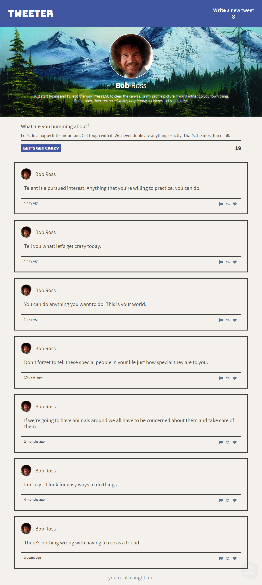

<!-- TITLE -->
<div align="center">

<p>
<h1>Tweeter: The Joy of Tweeting</h1>
<p>A single page Twitter clone that allows users to tweet like Bob Ross.
</p>

<p>Built with <a href="https://nodejs.org/en/">Node.js</a>, <a href="https://expressjs.com/">Express</a>, HTML, CSS/<a href="https://sass-lang.com/">SASS</a>, JavaScript, and <a href="https://jquery.com">jQuery</a>.</p>

<b><a href="https://ahhreggi-tweeter.herokuapp.com/" target="_blank">
   » View Live Demo «
</a></b>

</div>

<!-- INTRODUCTION -->

## 📚 Introduction

<p>
<i>"There are no mistakes, only happy accidents."</i> - Bob Ross
</p>

<b>[Tweeter](https://ahhreggi-tweeter.herokuapp.com/)</b> is a simple, single-page Twitter clone that allows users to post tweets... with a twist. As text is entered, the input is <i>automatically replaced</i> by [Bob Ross](https://en.wikipedia.org/wiki/Bob_Ross) quotes. Tweets may consist of multiple quotes, meaning each one is bound to be unique. It might sound a little crazy, but this actually works surprisingly well!

<b>Built with <a href="https://nodejs.org/en/">Node.js</a>, <a href="https://expressjs.com/">Express</a>, HTML, CSS/[SASS](https://sass-lang.com/), JavaScript, and [jQuery](https://jquery.com/).</b>

Tweet data is exchanged with a server via AJAX requests and rendered live using jQuery.

<!-- INSTALLATION -->

## 🛠 Installation

1. Clone or download this repository
   ```
   git clone https://github.com/ahhreggi/tweeter
   ```
2. Navigate to the project directory and install dependencies
   ```
   cd tweeter
   npm install
   ```
3. Launch the development web server
   ```
   npm run local
   ```
4. Visit <a href="http://localhost:8080/">http://localhost:8080/</a> on your browser

## 📷 Screenshots


