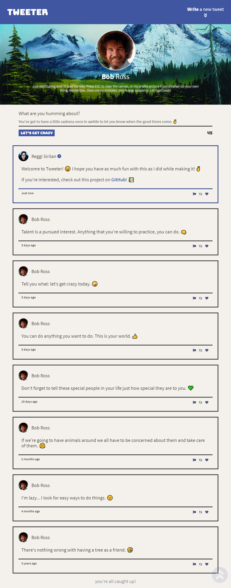

<!-- TITLE -->
<div align="center">

<p>
<h1>Tweeter</h1>
<p>A simple, single-page Twitter clone.</p>
<p><i>let's get crazy.</i> :)
</p>
</div>

<!-- INTRODUCTION -->

## 📚 Introduction

<b>Tweeter</b> is a simple, single-page Twitter clone that allows users to post tweets as [Bob Ross](https://en.wikipedia.org/wiki/Bob_Ross).

Data is exchanged with a server via AJAX requests and rendered live using jQuery.

<b>Built with <a href="https://nodejs.org/en/">Node.js</a>, <a href="https://expressjs.com/">Express</a>, HTML, CSS, JavaScript, and [jQuery](https://jquery.com/).

<!-- INSTALLATION -->

## 🛠 Installation

1. Clone or download this repository
   ```
   git clone https://github.com/ahhreggi/tweeter
   ```
2. Navigate to the project directory and install dependencies
   ```
   cd tweeter
   npm install
   ```
3. Launch the development web server
   ```
   npm run local
   ```
4. Visit <a href="http://localhost:8080/">http://localhost:8080/</a> on your browser

## 📷 Screenshots


